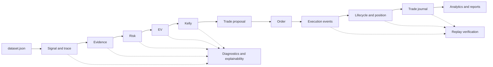

# Canonical Trading Pipeline Specification

**Status:** Architecture contract, documentation only
**Scope:** ATC replay and research artifacts
**Behavioral change:** None

## 1. Purpose

This specification defines the one conceptual pipeline used to describe an ATC
opportunity. It reconciles strategy decisions, lifecycle state, execution
events, trade records, verification, diagnostics, explainability, and
statistics. The specification does not alter strategy rules, thresholds,
calculations, execution assumptions, or replay behavior.

## 2. Canonical Pipeline

```text
Frozen Market Data
        |
        v
Signal -> Evidence Evaluation -> Risk Validation -> Expected Value -> Kelly Sizing
                                                                      |
                                                                      v
                         Trade Proposal -> Order -> Execution -> Position
                                                                  |
                                                                  v
                         Trade Close -> Trade Journal -> Analytics
```

Every rejection is a terminal decision for that candle or proposal and must be
represented by diagnostics, even when the execution lifecycle does not emit a
dedicated state for that decision.

## 3. Stage Contract

| Stage | Purpose | Inputs | Outputs | Success | Failure | Artifact | Responsible module |
|---|---|---|---|---|---|---|---|
| Market Data | Supply immutable replay candles | Frozen OHLCV snapshot, metadata, checksum | Ordered candles and dataset identity | Schema, checksum, timezone, and chronology validate | Dataset rejected or warm-up exclusion applied | `dataset.json`, `dataset-manifest.json` | Dataset library, frozen dataset validation |
| Signal | Evaluate existing signal components | Candle history and strategy context | Signal components, scores, gate result | Existing signal gate passes | `no signal` or signal rejection | `strategy-trace.jsonl` | `analyzeMarketData`, strategy trace |
| Evidence Evaluation | Apply existing evidence accumulation and investability checks | Signal output and existing evidence inputs | Evidence items, total score, pass/fail | Required evidence condition passes | Evidence rejection | Strategy trace and diagnostics | `analyzeMarketData`, diagnostics |
| Risk Validation | Apply the existing risk validations | Evidence-qualified decision, market state, risk profile | Validation results and decision | Risk checks pass | Risk rejection | Strategy trace; lifecycle rejection/validation state | `analyzeMarketData`, `tradeLifecycle` |
| Expected Value | Evaluate existing EV calculation | Existing win probability, average win/loss, threshold | EV value, threshold, pass/fail | EV meets the existing condition | EV rejection | Strategy trace and EV diagnostics | Quant decision pipeline |
| Kelly Sizing | Evaluate existing Kelly and allocation result | Existing Kelly inputs, cap, allocation threshold | Raw/capped Kelly, final allocation, pass/fail | Allocation passes existing minimum | Kelly rejection or zero allocation | Strategy trace and Kelly diagnostics | Quant decision pipeline |
| Trade Proposal | Create an actionable or paper opportunity record | Stage decisions and candle context | Proposal identity and terminal/progress state | Proposal is created for the replay decision | Proposal rejected/terminal | Lifecycle journal and proposal audit | `replayRunner`, lifecycle bridge |
| Order | Represent an entry or exit order attempt | Proposal, quantity, price, execution profile | Order identity and order intent | Simulator accepts order creation | Order creation rejected/cancelled | Lifecycle journal and execution metadata | Execution simulator |
| Execution | Resolve order fill/cancel/rejection | Order, candle price, slippage, spread, latency | Execution event and fill status | Fill event is produced | Rejection, cancellation, or gap handling | `execution-events.jsonl` | Execution simulator, execution event model |
| Position | Track exposure between entry and exit | Filled execution and open-position state | Open, update, or closed position state | Position state is valid | Position cannot be opened/updated/closed | Lifecycle events; currently inferred, no position journal | Lifecycle engine |
| Trade Close | Resolve the terminal position outcome | Position, exit execution, costs | Exit, P&L, close reason | Position closes once | Missing, duplicate, or invalid close | Lifecycle journal and trade draft | Lifecycle engine, trade journal |
| Trade Journal | Persist the completed trade as an immutable record | Entry/exit, costs, decision fields, lineage | Hashed `TradeRecord` | Required fields and hash validate | Journal validation failure | `trades.jsonl` | `tradeJournal` |
| Analytics | Aggregate immutable replay outputs | Trade journal, diagnostics, verification, regime metadata | Equity, metrics, reports, research findings | Inputs and hashes validate | Analysis marked limited or invalid | `analytics.json`, reports | Analytics and research modules |

## 4. Rejection Semantics

The canonical semantic stage is the first stage that fails. A candle can be
fully traced without creating an actionable trade proposal. The current replay
also creates a paper lifecycle proposal for rejected decisions so that the
lifecycle journal has a terminal record. That paper record is an accounting
representation, not evidence that the strategy passed the earlier gates.

The canonical final statuses are `no signal`, `signal rejected`, `evidence
rejected`, `risk rejected`, `EV rejected`, `Kelly rejected`, `proposal created`,
`execution`, and `completed trade`, matching the strategy trace contract.

## 5. Current Observability

The strategy trace is candle-granular and exposes intermediate decisions. The
lifecycle journal is state-transition-granular and focuses on proposal,
execution, and position state. Evidence, EV, and Kelly are not separate
lifecycle event types today. This is a reporting abstraction, not a strategy
disagreement. A future canonical decision journal can add explicit stage
events without changing calculations.

## 6. Pipeline Diagram With Artifact Flow



## 7. Non-Goals

This contract does not change signal generation, evidence accumulation, risk,
EV, Kelly, position sizing, execution, lifecycle behavior, replay iteration,
or strategy thresholds. It only establishes shared vocabulary and artifact
ownership.
